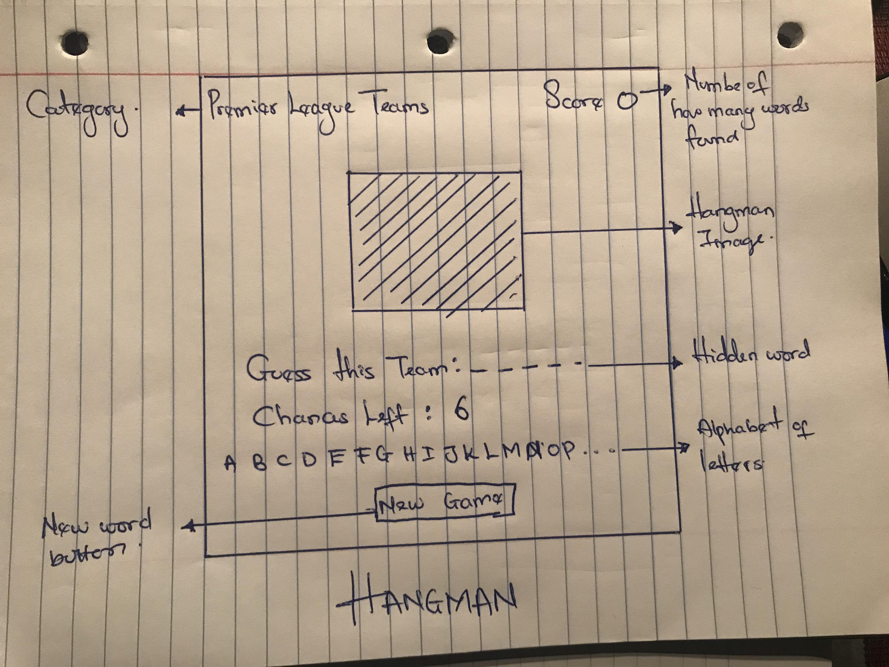

# Hangman-Project

General Assembly - Project 1

Project:https://wonderful-wozniak-e5de9d.netlify.com

GitHub: https://github.com/dipoosinubi/Hangman-Project

<h2>
OVERVIEW
</h2>

The goal of this project was to use HTML, CSS, and JavaScript to create a game that involved manipulating the DOM. I chose the challenge of creating this Hangman game because i believe it was a good way to put into practice what I have learnt so far in the Software Engineering Immersive course.

<h2>
WIREFRAME
</h2>

<h2>HOW TO PLAY</h2>
<ul>
<li>Click the New Game Button</li>
<li>The computer shows a random length of hidden letters</li>
<li>Click on the letters you believe may be in the word. </li>
<li>You have 6 chances to correctly guess every letter in the word.</li>
<li>If you guess the word before you use all your chances, you win. Otherwise, you lose.</li>
</ul>

<h2>TECHNOLOGIES USED</h2>
Languages --> HTML, CSS3, JavaScript

Libraries --> Javascript.
<h2>FUTURE IMPROVEMENTS</h2>
<ul>
<li>Add scoreboard showing. </li>
<li>Add more categories.</li>
<li>Add some sound/music.</li>
